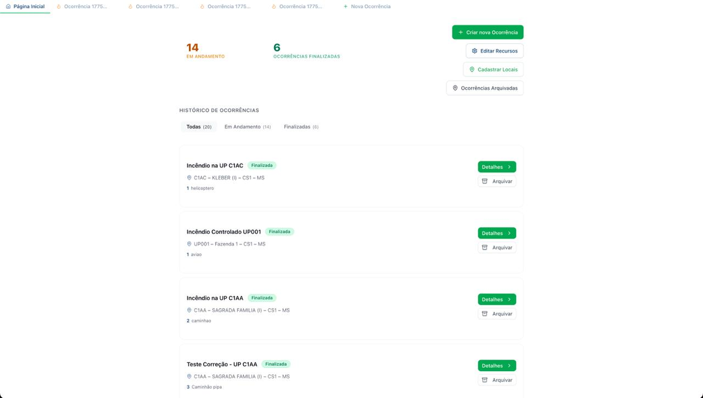
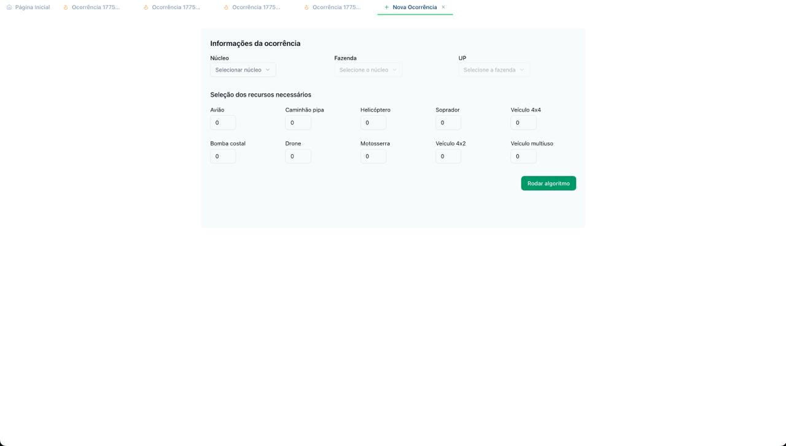
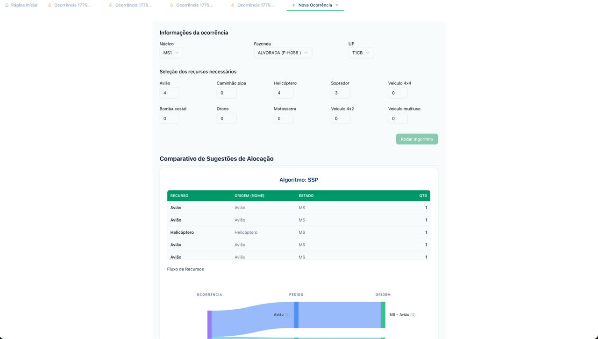
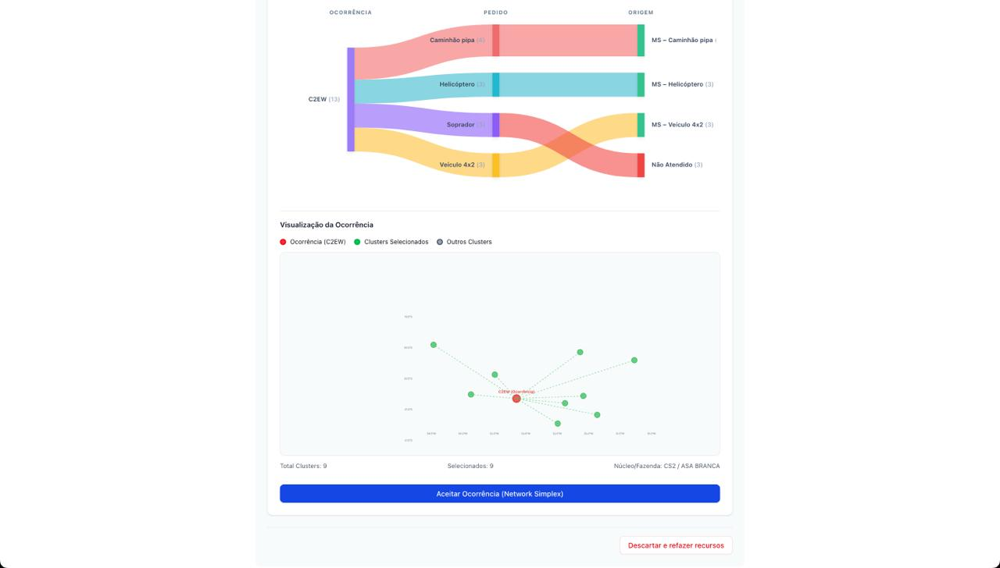

# Testes de Usabilidade - Método de Funil

## Atividade Ponderada 3

## 1. Introdução

Este documento registra o planejamento dos testes de usabilidade do fluxo de criação de ocorrência no sistema. Os testes foram conduzidos por meio da aplicação de perguntas em formato de funil, para identificar dificuldades de navegação, entendimento e preenchimento.

## 2. Tela(s) analisada(s)

### 2.1 Fluxo analisado

- Tela inicial/lista de ocorrências
- Ação "Nova ocorrência"
- Formulário de criação de ocorrência
- Confirmação de envio e retorno para lista/detalhe

### 2.2 Print da tela ou fluxo

- Print 1: lista de ocorrências (tela inicial)

- Print 2: formulário de criação (início do preenchimento)

- Print 3: formulário preenchido (revisão antes do envio)

- Print 4: confirmação/etapa posterior ao envio

### 2.3 Contexto

O teste avaliou se os usuários conseguem criar uma ocorrência do início ao fim sem ajuda externa. O foco foi validar a clareza dos campos, a sequência da navegação e a compreensão do resultado após salvar.

## 3. Tipo de teste

### 3.1 Classificação

- Tipo principal: Tarefa
- Apoio complementar: Conteúdo

### 3.2 O que será testado

Será testada a capacidade do usuário de localizar a funcionalidade, preencher corretamente os campos obrigatórios e concluir a criação da ocorrência. Também será observado se os textos da interface orientam adequadamente durante a tomada de decisão.

## 4. Conjunto de perguntas (lógica do funil)

### 4.1 Estrutura do funil (do amplo ao específico)

1. Contexto aberto
   Peça para o usuário observar a página inicial e descrever o que entende que pode fazer ali.
   Pergunta-base: "O que você acha que este sistema permite fazer?"

2. Intenção e descoberta
   Apresente a tarefa sem informar o caminho para execução.
   Pergunta-base: "Você precisa registrar um novo incêndio agora. Como começaria?"
   Neste ponto, mede-se a encontrabilidade da ação "Nova ocorrência".

3. Navegação e execução
   Observe o caminho até o formulário e o preenchimento dos campos.
   Perguntas-base: "Qual campo ficou mais claro?" e "Qual gerou dúvida?"
   Neste ponto, mede-se a compreensão dos rótulos, a ordem do formulário e as validações.

4. Confirmação e confiança
   Após salvar, valide se o usuário percebeu o sucesso e sabe o próximo passo.
   Pergunta-base: "Como você confirma que a ocorrência foi criada corretamente?"

5. Dor específica (fechamento do funil)
   Investigue o principal atrito observado na experiência.
   Pergunta-base: "Se você pudesse mudar uma coisa nesse fluxo, qual seria?"

### 4.2 Roteiro pronto (5 perguntas em funil)

1. Ao olhar esta página, o que você entende que pode fazer aqui?
2. Se precisasse cadastrar uma nova ocorrência agora, por onde começaria?
3. Durante o preenchimento, o que ficou claro e o que trouxe dúvida?
4. Depois de salvar, como você confirma que deu certo?
5. Qual foi o ponto mais confuso e como você melhoraria?

## 5. Objetivo do teste

Descobrir se a pessoa consegue sair da página inicial e concluir o cadastro de uma ocorrência sem ajuda, entendendo o que cada etapa significa.

## 6. Ação ou entendimento esperado

Ao final da interação, o usuário deve conseguir criar uma ocorrência sem apoio externo e compreender com clareza que a ação foi concluída com sucesso.

